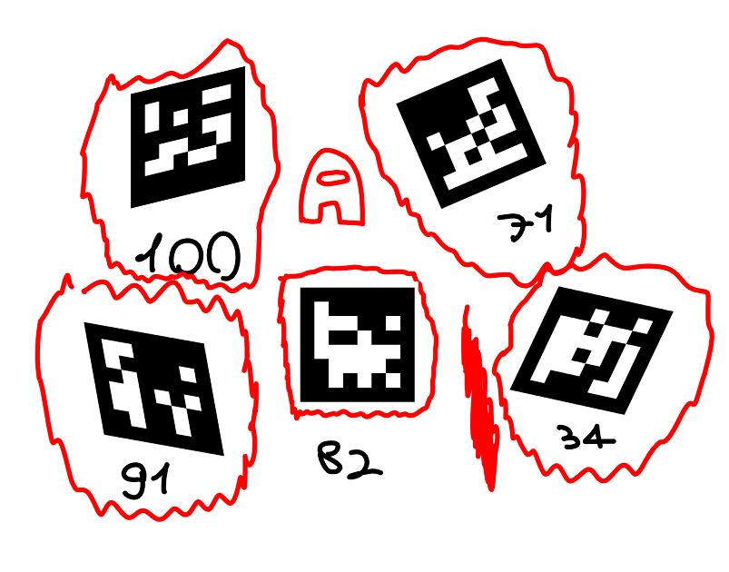

# Aruco-Detector

Repo che funziona da archivio per il progetto Aruco-Detector, features disponibili:
- Frontend
- Restapi

Piccoli appunti:

- Funzionano solo aruco MIP_36H12.

- Aggiunta l'api in python per lo streaming, quindi non ci sono più i problemi di prestazioni. L'unico problema è che al momento vanno avviate le due app separatemente eseguendo:
`npm start` e su un altro terminale `python streaming.py`

- ~~Siamo passati a https://github.com/samizdatco/skia-canvas per gestire i canvas con gli aruco, perchè la vecchia lib non disponeva della funzione necessaria per posizionare al di sopra degli aruco le immagini e deformarle a modo.~~


# Restapi

## Endpoint disponibili:

`/upload`

Facendo una richiesta POST verso questo endpoint viene restituito un json con una struttura simile in caso venga ritrovato almeno un aruco

```json
{
  "markers": [
    {
      "id": 71,
      "corners": [
        { "x": 436, "y": 114 },
        { "x": 552, "y": 65 },
        { "x": 601, "y": 179 },
        { "x": 486, "y": 229 }
      ],
      "hammingDistance": 0
    }
  ]
}
```

`/uploadimage`

Facendo una richiesta POST contenente un'immagine verso questo endpoint viene restituita un'immagine in base64 con dei riquadri attorno gli aruco rilevati

## Esempi

Richiesta con curl:

```bash
$ curl -F "file=@/path/to/file.jpeg" "http://127.0.0.1:3000/upload"
```

Richiesta con NodeJS:

```js
const axios = require("axios");

const image = fs.readFileSync("./image.jpeg");

const form = new FormData();
form.append("file", image, "file");

const response = axios.post("http://127.0.0.1:3000/uploadimage", form, {
  headers: {
    "Content-Type": "multipart/form-data",
  },
});
```

 
